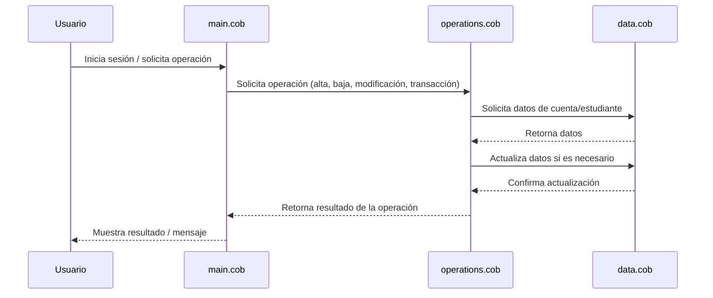

# Documentación de Archivos COBOL

Este proyecto contiene código COBOL para la gestión de cuentas de estudiantes. A continuación se describe el propósito de cada archivo, sus funciones clave y las reglas de negocio implementadas.

## Archivos COBOL

### `main.cob`
- **Propósito:** Archivo principal que inicia la ejecución del sistema de gestión de cuentas de estudiantes.
- **Funciones clave:**
  - Inicializa el entorno y llama a los módulos de operaciones y manejo de datos.
  - Controla el flujo general del programa.
- **Reglas de negocio:**
  - Verifica la validez de las operaciones antes de ejecutarlas.
  - Gestiona el ciclo de vida de la sesión del usuario.

### `operations.cob`
- **Propósito:** Implementa las operaciones principales sobre las cuentas de estudiantes.
- **Funciones clave:**
  - Alta, baja y modificación de cuentas de estudiantes.
  - Procesamiento de transacciones (depósitos, retiros, consultas de saldo).
- **Reglas de negocio:**
  - Valida que los estudiantes existan antes de realizar operaciones.
  - Aplica límites y restricciones según el tipo de cuenta.
  - Control de acceso y autorización para cada operación.

### `data.cob`
- **Propósito:** Maneja el almacenamiento y recuperación de datos de cuentas de estudiantes.
- **Funciones clave:**
  - Lectura y escritura de registros de estudiantes.
  - Actualización de información en la base de datos.
- **Reglas de negocio:**
  - Garantiza la integridad y consistencia de los datos.
  - Aplica validaciones sobre los campos obligatorios (nombre, matrícula, saldo, etc.).

## Reglas de Negocio Específicas
- Solo los estudiantes registrados pueden tener cuentas activas.
- Las operaciones de depósito y retiro están sujetas a límites definidos por la institución.
- Todas las transacciones deben ser registradas y auditadas.
- La modificación de datos sensibles requiere autorización especial.

---

Para más detalles, consulte los comentarios en cada archivo fuente COBOL dentro de la carpeta `src/cobol/`.

---

## Diagrama de Secuencia: Flujo de Datos de la Aplicación

